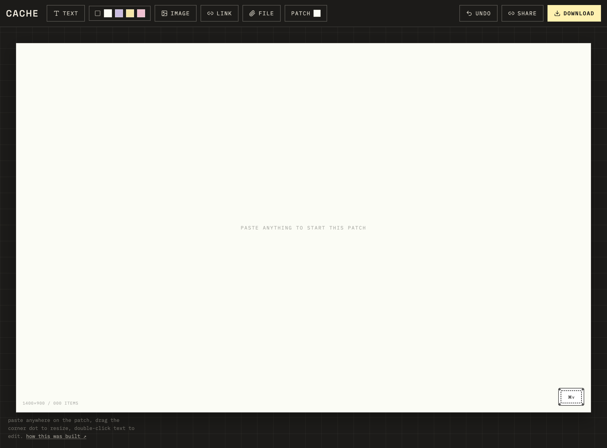
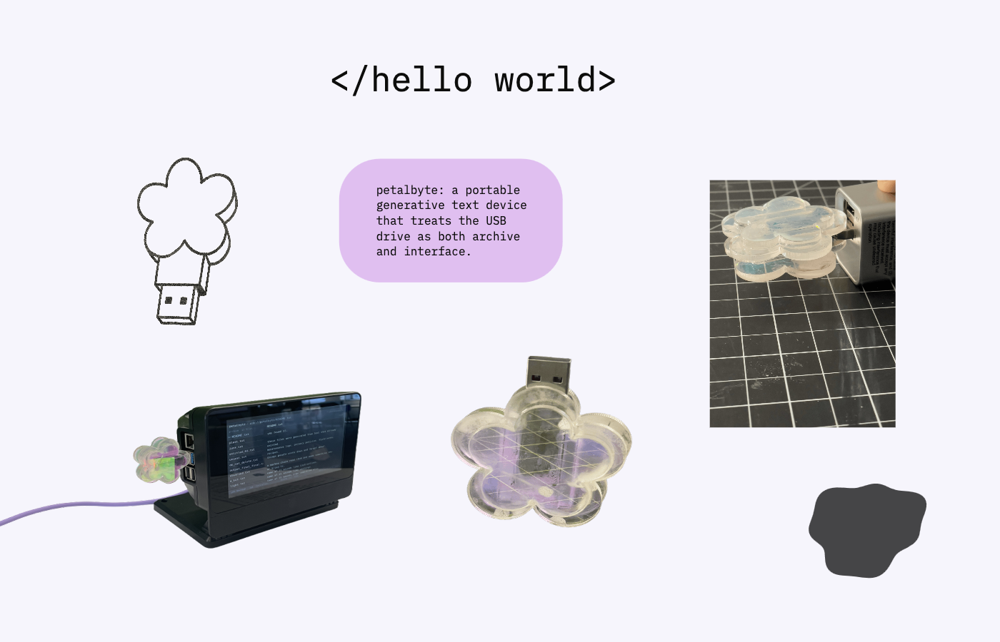

# cache

A moodboard tool where you paste, drag, and style inspiration like you actually think.

<i>create a patch ⬩ collect your stash ⬩ keep everything cached!</i>

## screenshots

<!--
  Drop real captures here before this goes anywhere public — right now these are placeholders.
  These four match the actual shotFrame slots in app/case-study/CaseStudyClient.jsx, in the order
  they appear on the page:
  1. Empty patch, cursor mid-paste, first card landing (section 01)
  2. A link card + a PDF file card side by side on the patch (section 02, flow step)
  3. The full patch UI at real size — toolbar, canvas, a real patch in progress (section 05)
  4. The moodboard patch itself, exported from cache (section 05, right after #3)
-->





## running it

```bash
npm install
npm run dev
```

then open http://localhost:3000

## what's in here

- `app/layout.js` — loads Space Grotesk (display) + IBM Plex Mono (everything else), plus four more
  preset fonts (Playfair Display, Inter, Caveat, JetBrains Mono) for the in-app font picker, all via
  `next/font/google` — no external `@import`, no flash of unstyled text
- `app/page.js` — renders the board
- `app/case-study/` — the full write-up of the build (problem, positioning, naming, the cache/CS
  concept, visual direction, real bugs)
- `app/api/unfurl/route.js` — server-side link unfurling (og:title/og:image extraction)
- `components/CacheBoard.jsx` — the whole tool: paste-to-add, drag, resize, per-piece styling (fill,
  font, corner radius, rotation, opacity, layer order), canvas background (color/pattern/image), PNG/
  PDF/HTML export, and a shareable link
- `components/CacheBoard.module.css` — all the styling, as plain CSS Modules (no Tailwind)
- `components/ColorPicker.jsx` — the custom in-app color picker (saturation/hue popover), replacing
  the browser's native color dialog
- `app/globals.css` — a small reset plus the `.fg-brand` class for the display face

## vocabulary

Every tool in this space names its unit of work differently — Figma has files, Are.na has
channels, Notion has pages, Cosmos has clusters. Cache's naming:

| generic term                | cache's word |
| --------------------------- | ------------ |
| board / canvas              | **patch**    |
| folder (a group of patches) | **stash**    |
| saved / saved to database   | **cached**   |

A patch is the single infinite canvas — what `CacheBoard.jsx` renders. A stash is the
organizational layer above it (a folder of patches) — not built in this starter; see the
roadmap below. "Cached" replaces "saved" everywhere in the UI: the share-link toast reads
"cached — link copied," and the exported file is just `patch.png`, no product name needed
since it's already sitting in your downloads folder next to the app that made it.

## positioning

Pinterest is for discovery. Are.na is for archives. Cosmos is for collecting. Milanote is for planning.
Figma/FigJam is for collaboration.

**cache is a browser window that becomes a personal visual thinking space.**

Not a board you build toward a finished state — a room you keep walking back into. Open it, hit paste, it's already there.

Cache is a creative workspace for collecting, arranging, and crafting ideas without the friction of traditional design tools.

## tech stack (planned — this starter uses hand-rolled canvas logic as a proof of concept)

**Frontend:** Next.js, React, TypeScript. Styling is plain CSS Modules (`CacheBoard.module.css`)
— no Tailwind, no build-time class generation. Next.js supports CSS Modules natively with zero
config, so there's no PostCSS/Tailwind toolchain to maintain.

**Canvas:** [tldraw](https://tldraw.dev) — infinite canvas SDK with pan/zoom/select/resize/rotate/
undo built in. Define custom shape types for image, embed, color, and text cards, and layer the
existing style panel on top of tldraw's shape/selection events instead of hand-rolling drag and
resize math (which is what `CacheBoard.jsx` currently does, for a dependency-free demo).

**Database:** Supabase (Postgres + Storage) — bundles DB, file storage, and auth in one project,
which matters most for shipping v1 fast without wiring together three separate services. It's vanilla
Postgres underneath, so nothing's locked in if this needs to move to Neon + Drizzle later for more
schema control.

**Storage:** Supabase Storage (S3-compatible underneath; Cloudflare R2 is the fallback if storage
needs move off Supabase specifically)

**Auth:** Better Auth over Clerk — this app's core UX is "no account required, optional save later"
via a guest board id + edit token (see below). Better Auth lives in the same Postgres as everything
else, so "upgrade this guest board to my account" is a plain database write. Clerk ships faster but
fits a more auth-first product, and bills per monthly active user.

**Link unfurling:** one `/api/unfurl` route. Check the pasted URL against known patterns first
(YouTube oEmbed, Spotify oEmbed, GitHub's REST API — all CORS-friendly and callable straight from
the browser with zero backend), and fall back to server-side `og:image` / `og:title` scraping for
anything else. Instagram is worth flagging now: their thumbnails are locked down without official
API access/business verification, so plan for a plain link card there rather than promising a
thumbnail.

## case study

`/case-study` is a full write-up of the build — the problem framing, the competitive landscape, the
naming decisions (patches/stashes/cached, plus the actual computer-science meaning of "cache"), the
visual direction's actual evolution (including the two passes that got rejected before the current
one), and three real bugs with root causes.
Reuses the exact same design tokens and signature motifs (the corner tag, the bracket selection marks)
as the tool itself, so the write-up and the product read as one coherent thing rather than a separate
marketing page bolted on afterward. Two spots are marked as screenshot placeholders — drop in real
captures of the running app once it's deployed.

The page itself is split into `page.js` (a plain server component, just for the `metadata` export —
Next.js requires that live in a server component) and `CaseStudyClient.jsx` (`"use client"`, everything
actually rendered). Framer Motion drives a scroll-progress bar at the top, a staggered hero entrance,
scroll-triggered reveals per section, a subtle idle float on the corner patch mark, and hover lifts on
the evolution steps, reference cards, bug cards, and vocabulary cells.

## favicon

`app/icon.svg` is the same patch mark used throughout the app (white fabric, lavender stitching, the
embroidered ⌘v) — Next.js auto-detects this filename and serves it as the favicon/app icon with no
extra config.

## mobile view with and without floating window

| Mobile View                                           | Demo                                                  |
| ----------------------------------------------------- | ----------------------------------------------------- |
|  |  |

## inspiration


## known limits of this starter (the real v2 list)

- **the page-level help text kept overlapping the board, no matter which corner it floated in.** First
  attempt moved it from bottom-left (where it collided with the board's own HUD readout) to top-left —
  but the board can extend nearly to the top of the page too, so the light-colored help text (styled
  for contrast against the dark page background) ended up sitting partly on top of the board's own
  light background instead, just as illegible. Floating this text anywhere over the canvas area was
  fundamentally fragile, since the board's size and scroll position vary. Fixed properly by moving it
  out of the canvas overlay entirely: a small help icon in the toolbar itself opens a popover with the
  same content. The toolbar and the board are structurally separate regions, so this can't collide
  with the board regardless of its size, position, or zoom — not a smarter position, a different
  container.

- **manual line breaks in a text card were being silently lost.** Double-click to edit, press Enter to
  force a line break, click away — the break looked right while editing, then collapsed back into one
  line. The save-on-blur handler read `e.currentTarget.textContent`, which is purely text-based and
  ignores block-level DOM structure entirely — it just concatenates every text node together with
  nothing in between, so whatever `<div>`/`<br>` the browser inserted for the Enter key got thrown
  away. Fixed by reading `.innerText` instead, which is layout-aware and correctly turns visual line
  breaks back into real `\n` characters. Separately, worth knowing this doesn't fix: natural
  word-wrap (no manual break, just the browser deciding where to wrap based on box width and font)
  will never pixel-match an external reference image exactly, since that depends on the actual font
  and box width in use here versus whatever tool made the reference — that's not a bug, just how text
  reflow works. If an exact wrap point matters, typing the break yourself (now working correctly) is
  the reliable way to guarantee it regardless of box width.

- **rotation now has a real rotary knob instead of a slider, and it sweeps the full circle.** It's
  the one control where the metaphor is exact rather than borrowed — turning a dial and rotating a
  piece are the same motion, unlike font size/opacity/corner radius, where a knob would just be a
  slider in a costume. Drag anywhere around the dial to set the angle; the knob's visual position maps
  1:1 to the actual rotation value (both run -180° to 180°), so there's no unit conversion anywhere
  between what you see and what gets set. Originally shipped clamped to ±45° (inherited from the old
  slider's range) — a dial that only sweeps a small wedge doesn't read as an actual rotary control, so
  it now goes all the way around.

- **the floating panel's drag handle is icon-only now** (a grip icon, not a text label) — meant to
  read as intuitively draggable without needing an instruction. The handle row also shows the
  selected piece's type and a minimize toggle. Minimizing collapses the panel down to just that
  header row, so it's out of the way without needing to drag it off the piece entirely; clicking it
  again expands the full controls back.

- **autosave switched from localStorage to IndexedDB.** localStorage's ~5-10MB quota was getting
  exceeded fast with more than a few embedded images (base64 is already ~33% larger than the source
  file) — and once the quota was hit, the _entire_ save silently failed, not just the newest addition.
  That's exactly why "some images saved, some didn't." IndexedDB's quota is dramatically larger and
  is the right tool for this amount of data. A one-time migration reads any pre-existing localStorage
  save on first load and clears it after moving it over.
- **cmd/ctrl+s (or the new save button next to undo) saves immediately**, bypassing the normal
  500ms autosave debounce, and shows a status message ("cached" or a real error if it fails) so
  there's confidence the save actually happened — useful right before closing the tab.
- **cmd/ctrl+c copies, cmd/ctrl+x cuts** — either the single selected piece, or, with select-all
  active (cmd/ctrl+a), every piece on the patch at once. Right-clicking any single piece opens a menu
  with copy, cut, duplicate, and delete. Pasting a copied _group_ keeps every piece's position
  relative to the others (not stacked on top of each other), and is a single undo step regardless of
  how many pieces landed. **Actually writes to the real OS clipboard now** (`navigator.clipboard`),
  not just an in-memory ref — the first version only worked within one tab, because a ref lives
  entirely in that tab's JS memory. That meant copying in one cacheboard tab and pasting into a
  _different_ tab (or a different saved patch entirely) silently couldn't work — which is exactly
  what looked like "copy-all isn't really working." Now cmd+v recognizes this app's own clipboard
  format first (a JSON payload with a marker key) before falling through to its normal behavior
  (image/link/text from anywhere else), and right-click "paste" tries the real clipboard too, falling
  back to the same-tab ref only if the OS clipboard read fails (permissions, non-secure context).
  Copy something in one open cacheboard tab, switch to another, cmd+v — it's there.

- **the floating style panel can now be dragged out of the way.** It always opens at a fixed
  top-right position, which meant it could sit directly on top of whatever you just selected — most
  noticeable with a large image. A small "drag to move" handle at the top of the panel lets you
  reposition it anywhere; double-clicking the handle resets it back to the default spot. Position
  persists for the session (not per-piece) — once it's out of the way, it stays out of the way for
  the next selection too.

- **pasted/uploaded content no longer auto-selects.** The floating style panel opens whenever
  something's selected, and every new piece used to auto-select itself — for a freshly pasted image,
  that meant the panel immediately covered the thing you just added, before you'd even seen it.
  `addElement()` now takes an `{ autoSelect }` option: images, links, and files (paste, drop, or
  upload) land without selecting themselves, so the panel stays out of the way. Text and color blocks
  added via the toolbar still auto-select — those are deliberate "add a stylable thing" actions where
  opening the panel immediately is the expected next step.

- **background removal is working now** —


`BG_REMOVAL_ENABLED = true` in `components/CacheBoard.jsx`.
Getting here took three real attempts, worth recording honestly since the failures were as
instructive as the fix:

1. First hypothesis: `@imgly/background-removal` needs `SharedArrayBuffer`, which needs
   cross-origin isolation headers. Added `Cross-Origin-Opener-Policy` /
   `Cross-Origin-Embedder-Policy: credentialless` (not the stricter `require-corp`, which
   would've silently broken link-card preview images loaded from third-party sites with no
   `Cross-Origin-Resource-Policy` header). Verified the headers actually landed via `curl -I`
   against a real production server. **Didn't fix it.**
2. Second, a real bug, found and fixed: the library's `isAbsoluteURI()` check uses a regex
   requiring `//` right after the scheme (matches `http://`, not `data:`) — so it misread every
   pasted image's `data:` URL as a relative path. Fixed by converting to a `Blob` before calling
   `removeBackground()`. A genuine bug, confirmed by installing the package locally and reading
   its source — but **the same error persisted anyway**, meaning this wasn't the actual blocker
   either.
3. The real cause: the crash traced into `onnxruntime-web`'s own bundled WASM-loading code (a
   function named `RelativeURL`), which is exactly the subsystem `@imgly/background-removal`'s
   docs warn about — "currently only NextJS 15 is supported," and this app was on 14.2.5.
   The actual fix, once the app was upgraded to Next.js 15: load the library from a CDN
   (`https://esm.sh/@imgly/background-removal@1.7.0`) with a `/* webpackIgnore: true */` comment on
   the dynamic `import()`, instead of importing the local `node_modules` copy. Webpack never touches
   a webpack-ignored import, so it never rewrites `onnxruntime-web`'s internal `import.meta.url` —
   which is what was breaking `RelativeURL`'s WASM-path construction in the first place. Also passes
   `proxyToWorker: false` to keep the whole computation on the main thread rather than a Worker
   (worker construction hits the same `import.meta.url` pattern) — the tradeoff is a brief stutter
   while a removal is running, since it's no longer off-thread.

   This was a must add feature because I really enjoy removing backgrounds from images, especially for moodboarding!

- **the patch now actually fills the mobile screen.** It was fitting to width only, which works fine
  on desktop because laptop screens are close enough in aspect ratio to the 1400x900 board that
  width-fit happens to fill most of the height too — a portrait phone isn't close at all, so the
  board was rendering tiny with huge empty gaps above and below it. Mobile now fits to whichever
  dimension needs less zoom-out (like `background-size: cover` instead of `contain`), so the board
  fills the screen the way it does on desktop; the dimension that overflows scrolls/pans, which
  `boardWrap` already supported. Also switched mobile's alignment from centered to top-left anchored,
  since centering an overflowing board would've hidden its left edge behind an initial scroll
  position.

- **the "file" button won't create a generic file card for an image anymore.** It used to accept any
  file type with no restriction, which meant picking a photo through "file" gave you a boring
  icon-and-filename card instead of the actual image — same file, worse result, depending on which
  button you happened to click. Fixed two ways: the file input's `accept` now excludes image types (a
  UI hint, not fully enforced everywhere), and `handleFileUpload` checks the actual file type at
  runtime and redirects genuine images to the same path the "image" button uses, regardless of which
  button was clicked to get there.

- **cmd/ctrl+a selects everything on the patch**, native keyboard behavior on any OS. Once everything's selected, dragging any selected piece moves the entire patch together while preserving every piece's relative position. Delete/Backspace removes the whole selection (with undo support), Escape clears the selection, and cmd/ctrl+c, cmd/ctrl+x, and cmd/ctrl+v operate on the entire patch as a single group. This still isn't full multi-select — you can't shift-click arbitrary subsets of pieces or apply style changes to multiple pieces at once — it's specifically an "everything selected" workflow.

- **default patch background is `#fbfcf5`** — close to white, not stark white, so pasted images and
  cards still read as sitting on something rather than floating on pure white.

- **auto-saves to localStorage, per browser only.** Refreshing the page recovers your last patch —
  no more losing work on an accidental reload. This is _not_ shared, synced across devices, or
  backed by any server: it's purely "this browser remembers what was open last." The share link is
  still the only way to hand a patch to someone else, and it's a one-time snapshot, not a live
  document — editing after sharing doesn't update the link you already sent.
- **the toolbar's patch icon and pattern picker buttons now show a live preview** of the actual
  pattern (dots/grid/diagonal) instead of always a flat color swatch.
- **color-block pieces can be shaped now, not just rectangles** — rect (default), blob, or flower.
  All three come from one parametric silhouette function that generates a closed path from the
  piece's actual width/height, so it scales correctly on resize. The same path drives the live
  `clip-path`, the canvas export (via `Path2D`), and the HTML export — all three always match.
  Corner radius only applies to rect; it's hidden from the style panel for shaped pieces since it
  wouldn't do anything visible.
- **freeform/custom shape drawing isn't built** — genuinely a bigger feature (an actual drawing/brush
  tool, not just another preset) than blob/flower, so it's left as a real "not yet" rather than a
  half-built stub.

- **text pieces now have a font picker** — six presets (mono, display, serif, sans, handwritten,
  mono alt), all self-hosted via `next/font/google` in `app/layout.js` so there's no flash of
  unstyled text in the live app. There's also a "+ upload" option for a custom font file
  (`.woff`/`.woff2`/`.ttf`/`.otf`) — it's injected as a real `@font-face` rule and becomes usable on
  any text piece, not just the one it was uploaded for.
- **font rendering is now consistent across the live app and every export.** Canvas-based exports
  (PNG, PDF) call `document.fonts.load()` before drawing text so the chosen font is actually ready,
  instead of silently falling back to a generic monospace like the very first version of export did.
  The HTML export pulls preset fonts from the Google Fonts CDN (no `next/font` outside the live app)
  and embeds custom uploaded fonts directly as `@font-face` with their real bytes, so that export
  stays fully self-contained.

- **the download button now offers two formats.** PNG is the flat visual snapshot (what it always
  did). HTML exports a single self-contained file where link cards stay real `<a href>` tags and
  file cards stay real openable/downloadable links — genuinely functional, not just a picture of a
  document icon. No backend involved; everything (images, files, link previews) is inlined as data
  URLs in the one HTML file, so it's fully portable but can get large fast with big attachments —
  same size caveat as the share link, just landing in a downloaded file instead of a URL.

- **links now unfurl into real cards.** Paste a URL (or use the link button) and it lands
  immediately as a placeholder card, then `app/api/unfurl/route.js` — a small server-side route —
  fetches the page and extracts `og:title` / `og:description` / `og:image` to enrich it. This route
  runs server-side specifically to dodge the browser's CORS restrictions on fetching arbitrary pages;
  it uses regex-based tag extraction, which is fine for a starter but fragile against malformed HTML —
  swap in a real HTML parser (e.g. `cheerio`) if this needs to be more robust. Each card has an explicit
  "open ↗" button rather than making the whole card clickable, so opening a link doesn't fight with
  dragging it.
- **files (PDFs, docs, anything) work the same way as images** — stored inline as a base64 data URL,
  no backend needed to add or open them. **The real limit is share links:** a PDF of any real size
  will blow past what's practical to encode into a URL hash (already flagged above for background
  images — this makes it much more likely to actually bite). A multi-page PDF shared this way may
  simply produce a broken/truncated link. This is the clearest signal yet that "real" sharing needs
  actual file storage (Supabase Storage / Cloudflare R2) with the board referencing a URL rather than
  embedding bytes — everything else about the guest-edit-token sharing model stays the same once
  that swap happens.
- **link preview images are loaded with `crossOrigin="anonymous"`** for canvas export safety — if the
  source site doesn't allow CORS on its preview image, the export just falls back to a blank card
  background rather than failing (or breaking the whole PNG export via a tainted canvas).

- **`@imgly/background-removal` (used for the "remove background" button) is AGPL-3.0 licensed —
  disclosed here on purpose, not routed around.** AGPL generally requires that if an app runs as a
  network-accessible service, the app's own source has to be made available under AGPL too, unless a
  commercial license is purchased from IMG.LY. The library's own docs are direct that it's
  "free for use under the AGPL license," with a commercial option listed for anyone who needs
  something else — this isn't a loophole, it's the intended use. The decision here was to keep it and
  say so plainly rather than swap in something worse just to dodge a license conversation. This isn't
  legal advice; if the terms of a specific deployment ever matter (e.g. a future commercial version
  with different obligations), that's worth a real read of the license or a conversation with a
  lawyer at that point — alternatives if it ever needs to change are a paid IMG.LY commercial license,
  or a client-side segmentation model under a more permissive license (matting quality varies more by
  model than this library's purpose-built one).
- **background removal runs entirely client-side** — a WASM/ONNX model loads in the browser (via
  a `webpackIgnore`d dynamic `import()` from `esm.sh`, so webpack never bundles or touches it — see
  the entry above for why that specifically matters) and processes the image locally. First use in a
  session will be slower while the model downloads; subsequent removals in the same session are
  faster.
- **the original image is kept** as `originalSrc` on the element once background removal runs once,
  so "restore original" is always available without needing undo. Worth knowing: this roughly doubles
  that image's payload size in the share-link hash, compounding the size caveat already noted above.

- **undo is in-memory only** — cmd/ctrl+z or the undo button steps back through a 50-entry history
  held in a ref; it resets on page reload. Persisting undo history isn't usually worth it once
  real save/cache exists — reloading a saved patch is the natural reset point.
- **delete works via the trash icon in the style panel or the Delete/Backspace key** once something's
  selected (guarded so it doesn't fire while you're actively typing in a text card or an input).
- **pasted/dropped pieces land on a cascading diagonal offset** instead of dead-center, so repeated
  pastes don't stack exactly on top of each other. If you want the last-pasted piece back where you
  started, undo is the fastest way there.

- **no stashes yet** — this starter is a single patch with no organizational layer above it.
  a `stashes` table (id, name, owner) with a `patch_id -> stash_id` foreign key is the natural
  shape once patches need grouping.
- **v2 idea: a visible history of previous patches.** Right now there's exactly one patch per browser
  (the IndexedDB autosave holds a single `lastPatch`, overwritten every time). A real "see your past
  cacheboards" gallery — thumbnails of previous patches you can reopen — is a genuinely different
  feature from stashes (stashes group patches you're actively organizing; this is closer to a
  browsing history/version list of everything you've ever made). Needs each save to become its own
  row (`patches` table: `id`, `created_at`, a thumbnail, the board JSON) instead of one overwritten
  key, plus a small gallery view to browse them. Not attempting this now — noting it here on purpose
  as a real v2 direction rather than scope-creeping it into this pass.
- **background images make the share-link hash very long.** The URL-hash sharing trick already had
  a size ceiling; a background image (base64-encoded) makes that much more likely to matter. This is
  the clearest sign it's time to move share-links to a real `boards` table + short id (see above)
  rather than pushing the hash approach further.
- **share link has no backend, but it's now gzip-compressed instead of just base64'd.** The original
  encoding was `btoa(encodeURIComponent(json))` — `encodeURIComponent` triples every quote character
  into `%22` _before_ base64 even runs, then base64 adds its own ~33% on top of that already-bloated
  string. For a real patch with several pieces, this was making links 2-3x longer than necessary for
  no reason. Now: straight to UTF-8 bytes (no percent-encoding detour), gzipped via the native
  `CompressionStream`/`DecompressionStream` APIs, then base64url-encoded. For an empty board this is
  actually slightly worse (gzip's fixed header overhead isn't worth it for ~80 bytes of JSON), but for
  a real patch with a handful of pieces — where JSON keys like `type`/`x`/`y`/`w`/`h`/`rotation`/
  `opacity` repeat across every element and compress very well — this cuts a real link by roughly 85%.
  Old links (from before this change) still work: decoding tries the new format first and falls back
  to the old plain-base64 format if that fails. **Still doesn't fix the actual ceiling** — compression
  helps text-heavy JSON a lot, but does very little for embedded images, which are already
  dense/near-random base64 and don't compress meaningfully. A patch with a background image or a few
  photos will still produce a huge link. The real fix is still what it always was: a `boards` table, a
  random board id + a separate edit-token, and the link becomes `/b/{id}`. Same no-account-required
  UX, no size ceiling at all.
- **no accounts yet** — the guest-edit-token pattern above is what makes "save it later" possible
  without forcing signup up front.
- **connections/flows between pieces** were intentionally left out of this pass — good v2 candidate
  once the core paste → style → export loop is validated with real use.
- **image storage** is currently inline as base64 in the JSON — fine for a single board, move to
  Supabase Storage once boards need to be shareable at any real size.
- clipboard-paste of images is unreliable on mobile Safari — the image button in the toolbar is the
  dependable path there. dropping a folder (not pasting — clipboard can't carry folders) is the
  right affordance for "all images in this folder appear at once."

## deploying

this is a stock Next.js app, so `vercel deploy` from the project root works with zero config.
